# Análisis del desempeño financiero de Adventure Works con SQL
**Herramientas:** SQL | Excel

**Tipo de proyecto:** Análisis financiero | Business Intelligence

**Contexto:** Proyecto académico - TripleTen Data Analytics Bootcamp

## Contexto del negocio
El *director financiero de Adventure Works* necesita tomar decisiones de inversión en marketing para 2018. Para ello, solicita respuesta a dos preguntas clave:

1. ¿Cuánto se está generando por país?
2. ¿Qué tan rentable es cada mercado considerando los gastos de campaña?

Como analista jr., el objetivo fue implementar las etapas del análisis de datos desde las tablas fuente hasta los indicadores financieros clave por país: ingresos, costos, beneficio bruto, margen y ROI.

## Diagrama Entidad Relación
El análisis utilizó un subconjunto del dataset AdventureWorks compuesto por 6 tablas:
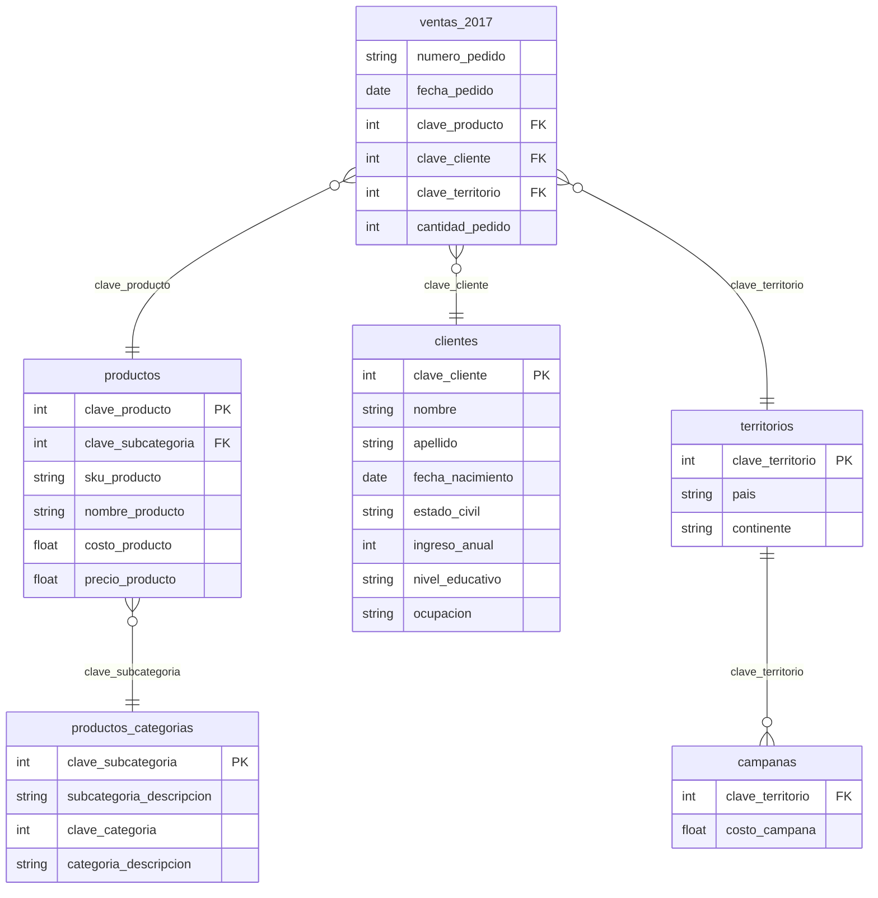

## Etapas del análisis
1. **Exploración del esquema** (exploración_datos.sql)

   Se realizó una inspección inicial a las 6 tablas para comprender la estructura de columnas, tipos de datos e identificar las claves de unión entre las tablas.

   **Técnicas utilizadas:** SELECT, FROM, LIMIT

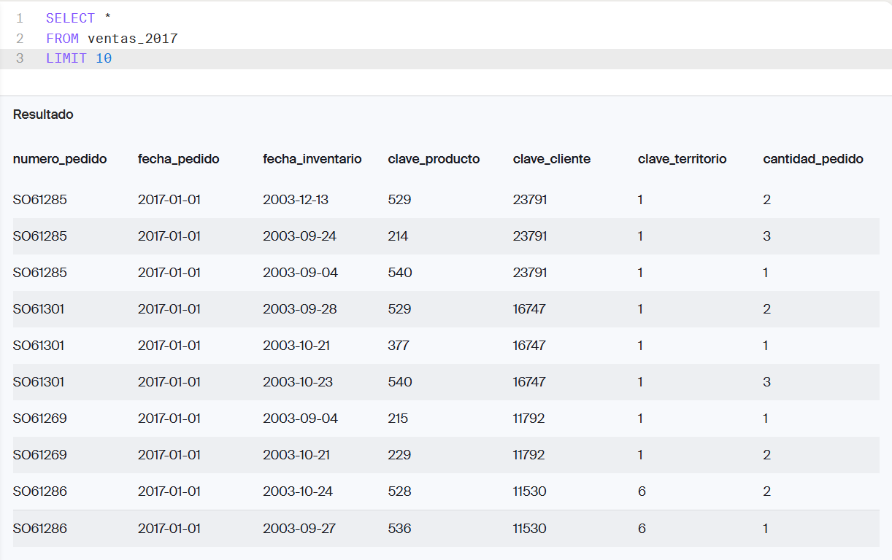
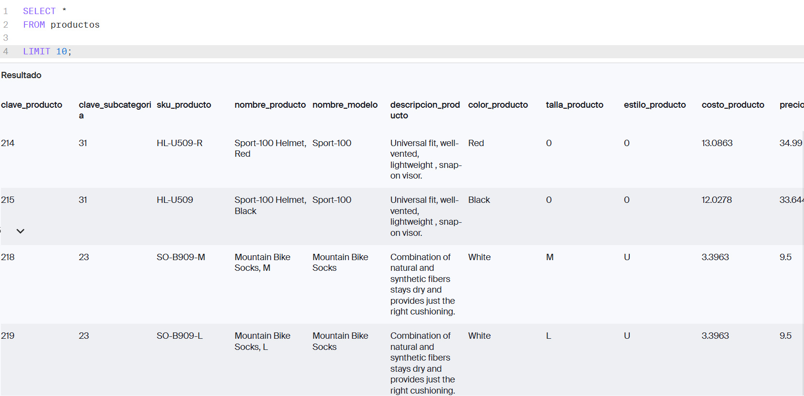
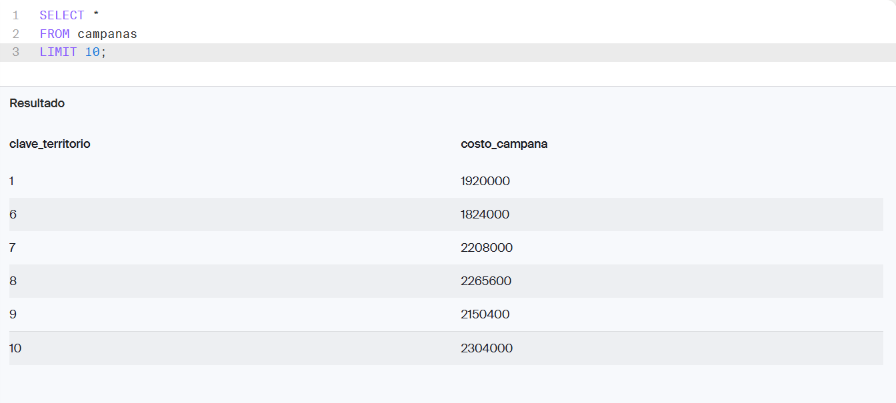
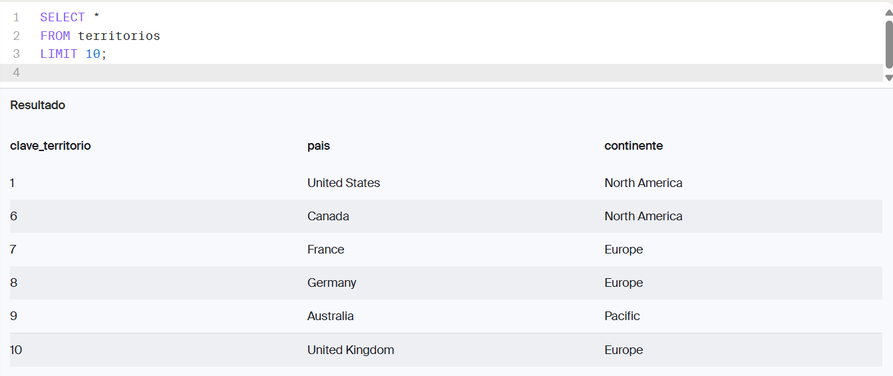
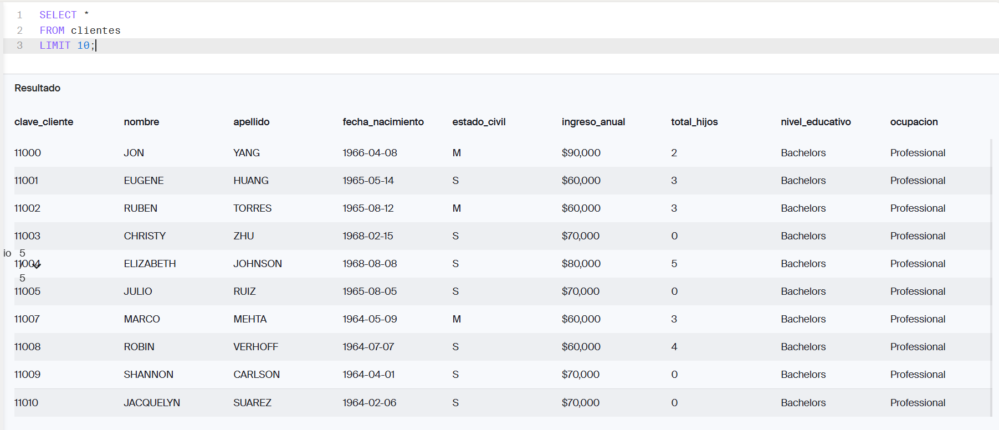

2. **Extracción y limpieza de datos** (exploracion_limpieza_datos.sql)

   Por medio de JOINs de 4 tablas, construí un dataset con fines analíticos, reemplazando valores nulos y calculando métricas por línea de pedido.

   **Técnicas utilizadas:** JOIN, LEFT JOIN, COALESCE

   **Columnas generadas:**
   | Columna | Fórmula |
   | --- | --- |
   |ingreso_total | precio_producto * cantidad_pedido |
   | costo_total | costo_producto * cantidad_pedido |

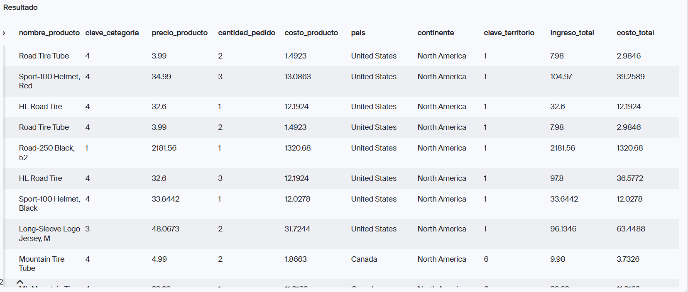   

4. **Indicadores financieros** (indicadores_financieros.sql)

   Se agrupó el dataset por país para calcular los indicadores solicitador por el director financiero

   **Técnicas utilizadas:** SUM, GROUP BY, ORDER BY, NULLIF, casting con ::INTEGER
   **Columnas agregadas**
   | Columna | Fórmula |
   | --- | --- |
   | Beneficio bruto | ingresos - costos |
   | margen_pct | (ingresos - costos) * 100 / ingresos |
   | roi_pct | (ingresos - costos) * 100 / costo_campaña |

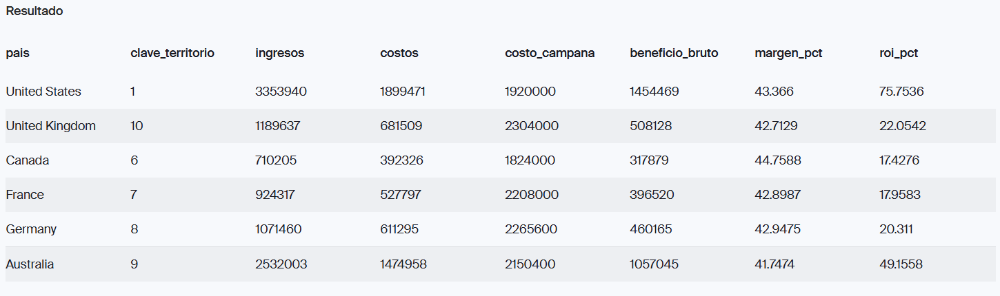

5. **Validación de calidad** (validación_resultados)

   Se realizó una comprobación para garantizar que el dataset está integro antes de presentar los resultados

   | Verificación | Resultados |
   | --- | --- |
   | NULLs en campos clave (numero_pedido, clave_producto, clave_territorio) | 0 Registros nulos |
   | Cantidades de pedido inválidas (cantidad_pedido <= 0) | 0 Registros inválidos |
   | Precios de productos negativos (precio_producto < 0) | 0 Registros inválidos |

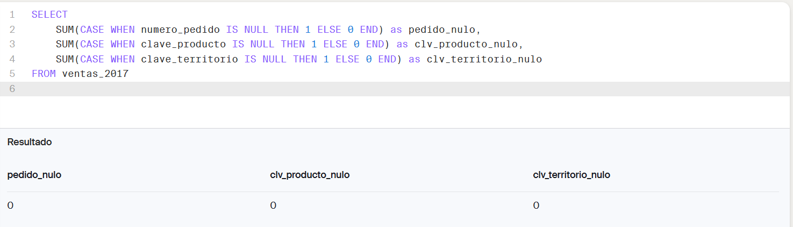
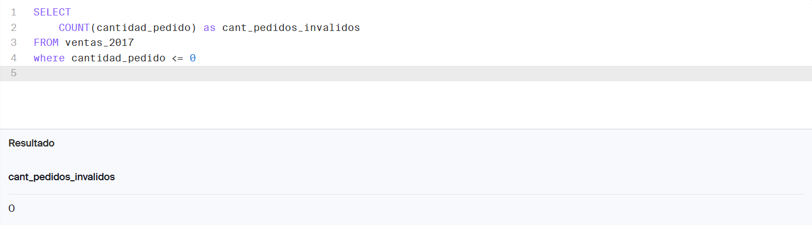
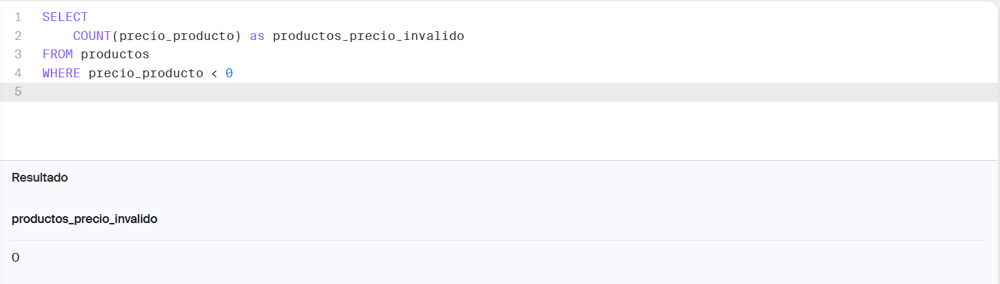

## Resultados
| País | Ingresos | Costos | Costo de campaña | Beneficio bruto | Margen | ROI |
| --- | --- | --- | --- | --- | --- | --- |
| United States | $3,353,940 | $1,899,471 | $1,920,000 | $1,454,469 | 43.4% | 75.8% |
| Australia | $2,532,003 | $1,474,958 | $2,150,400 | $1,057,045 | 41.7% | 49.2% |
| United Kingdom | $1,189,637 | $681,509 | $2,304,000 | $508,128 | 42.7% | 22.1% |
| Germany | $1,071,460 | $611,295 | $2,265,600 | $460,165 | 43.0% | 20.3% |
| France | $924,317 | $527,797 | $2,208,000 | $396,520 | 42.9% | 18.0% |
| Canada | $710,205 | $392,326 | $1,824,000 | $317,879 | 44.8% | 17.4% |

## Análisis ejecutivo (C-F-I)
### Contexto
Se analizó el dataset de ventas 2017 cruzando transacciones con territorios, productos y campañas de marketing para obtener ingresos, costos directos, costos de campaña, beneficio bruto, margen y ROI por país.
### Hallazgos
1. **Estados Unidos** lidera con el 34% de los ingresos totales ($3,353,940) y el segundo costo de campaña más bajo ($1,920,000), lo que explica su ROI superior (75.8%).
2. **Reino Unido** presenta el costo de campaña más alto ($2,304,000) con ingresos moderados ($1,189,637), resultando en ROI de 22.1%. Este bajo rendimiento coincide con el contexto macroeconómico de 2017: el país registró su menor crecimiento desde 2012 (PIB +1.7%) en medio de la incertidumbre post-Brexit, lo que pudo haber deprimido la respuesta del consumidor a las campañas.*
3. **Canadá** registra el ROI más bajo (17.4%), sin embargo presenta el margen de beneficio más alto del portafolio (44.8%), señal de que el negocio opera eficientemente, pero el gasto de campaña ($1,824,000) es desproporcionado respecto al volumen de ventas que genera

*Dato externo al dataset: [Brexit, Respuesta de referendum en el Reino Unido](https://www.britannica.com/topic/European-Union)

### Implicaciones
- **EE.UU.:** Mercado prioritario, sostener la inversión actual. El ROI de 75.8% justifica mantener el presupuesto de campaña sin recortes.
- **Reino Unido:** Mantener cautela antes de escalar inversión. El contexto político-económico de 2017 sugiere que el bajo ROI puede ser coyuntural, no estructural.
- **Canadá:** El margen alto indica potencial real. La recomendación es revisar la estrategia de campaña antes de escalar o recortar. El problema no es el mercado sino la eficiencia del gasto en marketing.

## Habilidades aplicadas 
- Navegación de esquemas relacionales e identificación de claves de unión
- Escritura de JOINs para combinar múltiples tablas
- Extracción, filtrado y limpieza de datos (COALESCE, NULLIF, CASE WHEN, casting de tipos)
- Cálculo de indicadores financieros: ingresos, costos, beneficio bruto, margen y ROI
- Control de calidad con verificaciones de integridad de datos
- Comunicación de hallazgos con el método Contexto → Hallazgo → Implicación

## Autor
Roberto Barrera García - Analista de Datos Jr. en formación

[LinkedIn](https://www.linkedin.com/in/robertobarreragarcia) | [GitHub](https://github.com/RobertoBG1111)
